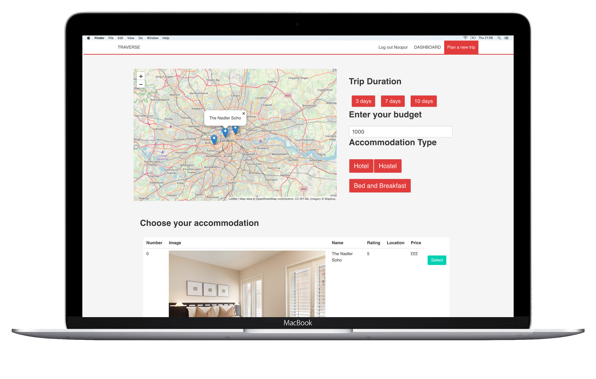
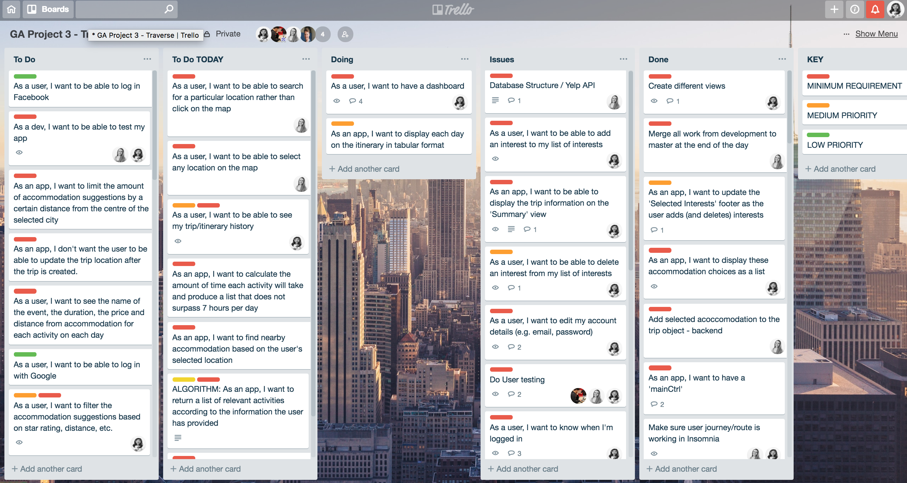

# Project Three - Traverse



Project Link: https://automated-travel-app.herokuapp.com/

## Technical Requirements
#### Server-side
- Use Mongo, Node & Express to build a server-side API
- Your API must have at least 2 related models, one of which should be a user
- Your API should include all RESTFUL actions for at least one of those models
- Include authentication to restrict access to appropriate users
- Include at least one referenced or embedded sub-document, however don't go crazy! You need to manage your time effectively...
- Include automated tests for at least one resource

#### Client-side
- Use Angular to build a front-end that consumes your API
- Use SCSS instead of CSS
- Use Webpack & Yarn to manage your dependencies and compile your source code

## Technologies Used
- HTML5
- CSS3
- JavaScript
- Bulma CSS Framework
- AngularJS
- Node.js
- Express.js
- MongoDB
- Leaflet
- GitHub
- Git

## Contributors
I built this application alongside <a href="https://github.com/LAukso">Laura Auksoriute</a>.

## Overview
Traverse is a MEAN full stack application which automates a users travel itinerary based on the location the user wishes to travel to, trip duration, accommodation and selected activities. The end result is a day by day plan of activities. The user can view all trips in their user dashboard. I worked in a pair to complete the project over a week.

## Approach Taken
We began brainstorming ideas on a whiteboard and then finalising on the wireframes. We then converted the ideas into user stories on our Trello board.



We started out by building and testing the backend, both in Insomnia and using Mocha/Chai test cases, before developing the front end. We wanted to ensure we could add as much functionality before styling.

The MVP of the application was to add the following features:
- Allow users to register and login securely


- Allow users to create a new trip, by inputting the location, trip duration, accommodation type, accommodation, interests (such as music, history, outdoor activities etc), and finally activities


- Allow users to see all created trips in their dashboard

## Wins
- My biggest win and my favourite piece of code was to filter the activities based on the selected user interests.

``` JavaScript
// Filter the activities according to the tripInterests
if(tripInterests.length) {
  // 1. Check all of the Activities
  // 2. Check each activity has an interest that matches the user's selected interest
  $scope.filteredActivities = $scope.activities.filter(activity => {
    return activity.categories.filter(category => tripInterests.includes(category)).length;
  });
}
```

## Challenges
- At the start of the project, we decided it made sense to include one front-end controller that handles creating a new trip. However we split the form to create a new trip into multiple pages and it become increasingly harder as the project proceeded to add new features into the controller, since variable names were overlapping with each other. This was the case especially for when we added maps. This is a huge learning experience, and a future feature will be to refactor and break up existing features into their own controllers.

## Future Features
- The initial idea was to group activities together by the distance they are from each other, ensuring that the user can explore as many activities (such as seeing a museum, attending a live show, outdoor sport activity etc.) with the shortest travel time between each activity per day. Due to time constraints, I was only able to randomise the activities per day rather than sort them by distance as we had initially planned. I would like to add this is a feature moving forwards.
- Fix bugs!
- One of the bugs is that all the activities from the database appear on the front-end, even after the user has chosen a particular location (for example, London). To fix this, I'd need to add another filter to ensure only activities for a particular city are shown.
- Fix another bug where the selected accommodation doesn't appear in the user dashboard.
- Allow the user to see more information about a trip from the dashboard, i.e. when the user clicks on a particular trip, it takes them to another view where more details are displayed, including interests, activities.
- Incorporate Yelp's API to include a vast number of cities, accommodations and activities.
- Add styling to make the application fully mobile and tablet responsive.
